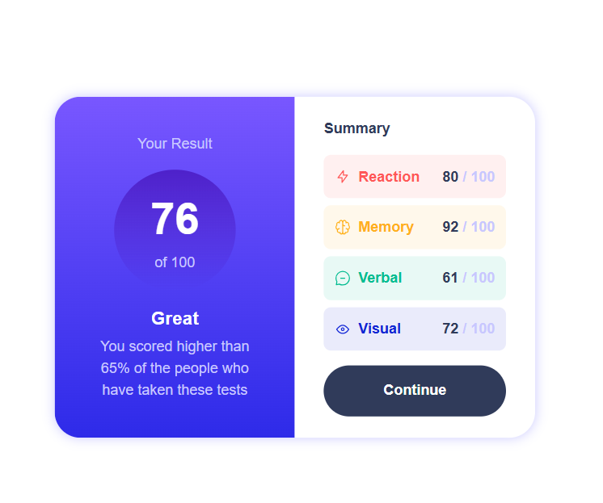

# Frontend Mentor - Results summary component solution

This is a solution to the [Results summary component challenge on Frontend Mentor](https://www.frontendmentor.io/challenges/results-summary-component-CE_K6s0maV). Frontend Mentor challenges help you improve your coding skills by building realistic projects. 

## Table of contents

- [Overview](#overview)
  - [The challenge](#the-challenge)
  - [Screenshot](#screenshot)
  - [Links](#links)
- [My process](#my-process)
  - [Built with](#built-with)
  - [What I learned](#what-i-learned)
- [Author](#author)
- [Acknowledgments](#acknowledgments)

## Overview

### The challenge

Users should be able to:

- View the optimal layout for the interface depending on their device's screen size
- See hover and focus states for all interactive elements on the page
- **Bonus**: Use the local JSON data to dynamically populate the content

### Screenshot

### Links

- Solution URL: [https://github.com/branalex94/frontendmentor-results-summary](https://github.com/branalex94/frontendmentor-results-summary)
- Live Site URL: [https://frontendmentor-results-summary.onrender.com](https://frontendmentor-results-summary.onrender.com)

## My process

### Built with

- Semantic HTML5 markup
- CSS custom properties
- Flexbox
- CSS Grid
- Mobile-first workflow
- [Angular](https://angular.dev/) - JS Framework
- [Tailwindcss](https://tailwindcss.com/) - JS Framework

### What I learned

This project helped me understand more deeply the better use cases and implementations of tailwindcss for more efficient styling.

## Author

- GitHub - [Brandon Aray](https://github.com/branalex94)
- Frontend Mentor - [@branalex94](https://www.frontendmentor.io/profile/branalex94)

**Note: Delete this note and add/remove/edit lines above based on what links you'd like to share.**
